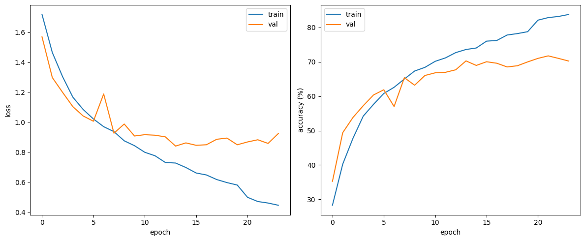

This project implements a deep learning system for classifying audio recordings into different emotional categories (Angry, Disgusted, Fearful, Happy, Neutral, Sad, Surprised). The system analyzes speech audio and predicts the emotional state of the speaker based on acoustic patterns.



### 🐉 Model Architecture

The model uses a hybrid CNN+GRU architecture:

- Convolutional Neural Network (CNN): Extracts spectral features from the audio MFCC representations
- Gated Recurrent Unit (GRU): Captures temporal dynamics in the audio data
- Bidirectional processing: Analyzes the audio sequence in both forward and backward directions
- Regularization: Employs dropout and L2 regularization to prevent overfitting

### 📊 Data Preprocessing

Audio samples are standardized to 3s length (66150 samples at 22050Hz). Features include 40 MFCCs extracted with FFT window size=2048 and hop length=512, plus their first and second derivatives (Δ, Δ²), resulting in 120-dimensional feature vectors. Batch normalization is applied for training stability.

### 🚀 Training and Inference

Training employs early stopping (patience=10) with ReduceLROnPlateau scheduling (factor=0.5). Class imbalance is addressed via weighted loss function, with weights inversely proportional to class frequency. Model checkpoints are saved based on validation accuracy maximization.

Pre-trained model weights are loaded from 'best_emotion_model.pth'. Test audio undergoes identical preprocessing (MFCC+Δ+Δ²). Emotion predictions are generated in a single forward pass and exported to submission.csv with [filename, emotion] format.

```bash
# 📁 Project Structure

config.py      # Configuration parameters for audio processing and model training  
prepare.py     # Data preparation and feature extraction functions  
model.py       # Model architecture and dataset class definitions  
train.py       # Training loop and model optimization  
inference.py   # Prediction generation for test data  
```

## 📦 Requirements

Make sure the following packages are installed:

- PyTorch  
- Librosa  
- NumPy  
- Pandas  
- tqdm  

You can install them using:

```bash
pip install torch librosa numpy pandas tqdm